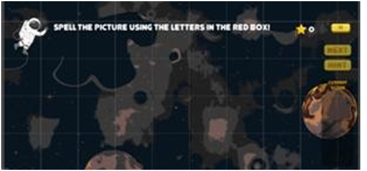
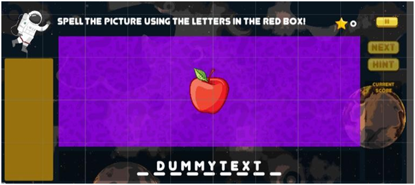
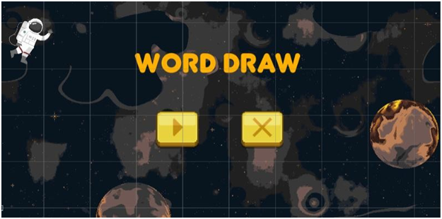
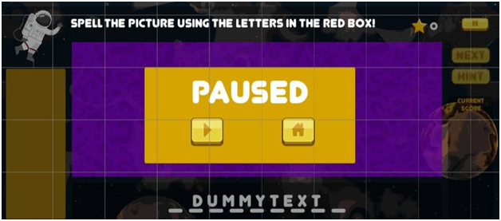
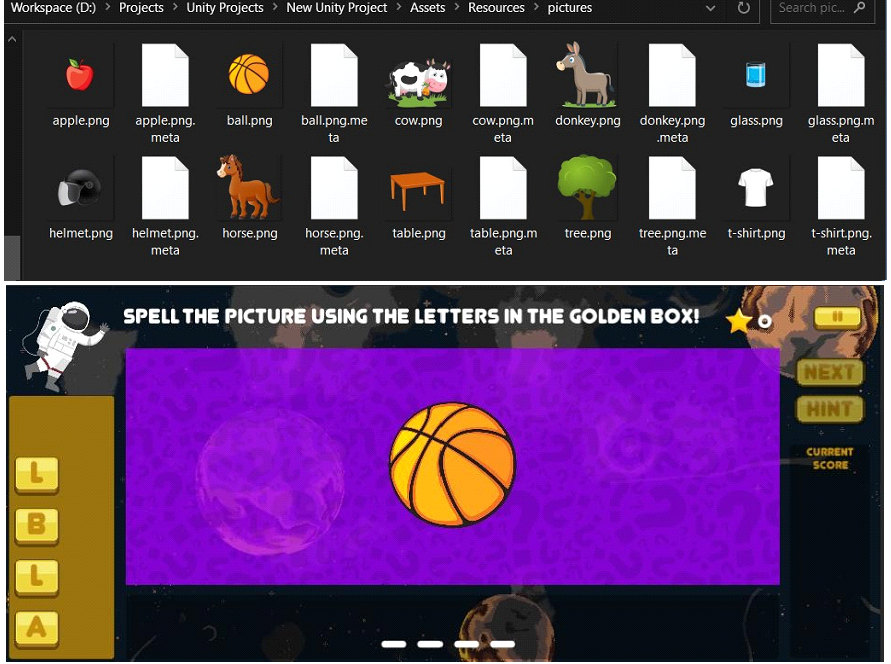
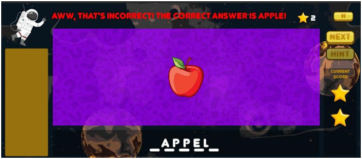
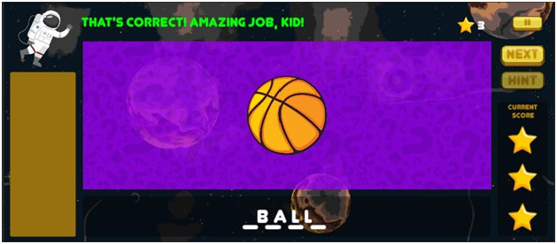
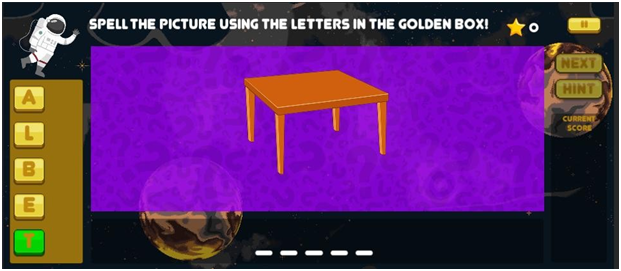

# Word-Draw

<ol>
  
  
  <li>
    Set a background image. Created UI buttons for pausing the game, for showing total score and current picture score, for hint and for going to next picture.
  </li>
   
  <li>
    Added some help text at the top and an astronaut character to make it more interactive. Added a ‘bobbing’ animation to all the objects for the sensation of an outerspace-like environment.
  </li>
   
  
   
   
   
  
  <li>
    Added panels for displaying picture, to show answer that is being formed, and for an inventory where the letters to be selected will be formed.
  </li>
   
  
   
   
   
  
  
  <li>
    Added a main menu.
  </li>
   
  
   
   
   
  
  
  <li>
    Added a panel for when game is paused.
  </li>
   
  
   
   
   
  
  
  <li>
    Created a folder where picture files are to be submitted.
    <ul>
      <li>
        The code parses through all png files in that folder, and adds them to a picture-list. The picture-list is then accessed randomly.
      </li>
      <li>
        The corresponding image is shown on the picture-panel (purple). Buttons with letters in the picture’s word as button-text are generated in random order in the inventory-panel (orange).
      </li>
    </ul>
  </li>
   
  
   
   
   
  
  
  <li>
    When the buttons in the inventory-panel are clicked, the letter in them is appended to the end of a string which is shown on the shelf-panel (translucent black).
  </li>
   
  <li>
    When all the buttons are finished:
    <ul>
      <li>
        If the spelling is correct, 3 stars are awarded as the current score.
      </li>
      <li>
        If the spelling is two-thirds correct, 2 stars are awarded.
      </li>
      <li>
        If the spelling is one-third correct, 1 star is awarded.
      </li>
    </ul>
  </li>
   
  
   
   
  
   
   
   
  
  
  <li>
    The NEXT button is enabled.
  </li>
   
  <li>
    If the spelling is not fully correct, the help text above turns red and shows the correct spelling. The word is not removed from the picture-list.
  </li>
   
  <li>
    If it is correct, it turns green and congratulates the player. The word is removed from the picture-list.
  </li>
   
  <li>
    When the next button is pressed, the current score and shelf-panel is cleared. The next picture’s information is loaded onto the inventory-panel and picture-panel. However, if the picture is last, the game ends, and the user is prompted to leave to the menu.
  </li>
   
  <li>
    If the user doesn’t select any letter for 30 seconds, the correct letter is highlighted by green.
  </li>
   
  
   
   
   
  
  
</ol>
